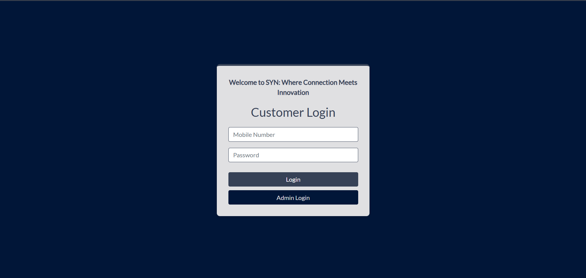
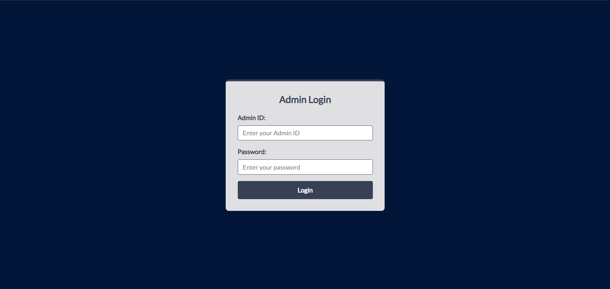
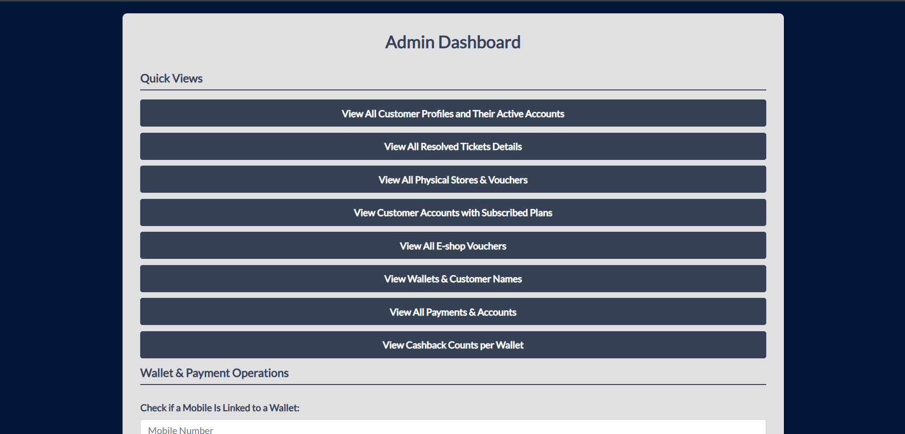

# SYN Telecommunication

## Project Title
SYN Telecommunication - Telecom Billing & Self-Service Platform

## Motivation
SYN Telecommunication was developed to provide a comprehensive telecom billing and self-service solution for both customers and administrators. The system addresses the need for an integrated platform where customers can manage their telecom accounts, view usage history, make payments, redeem vouchers, and track cashback rewards. For administrators, it offers a centralized dashboard to manage customer accounts, service plans, vouchers, and analyze usage patterns. This project demonstrates the implementation of a full-stack web application using ASP.NET Web Forms with a robust SQL Server backend, showcasing real-world business logic for telecom operations.

## Build Status
⚠️ **Current Issues:**
- Connection string in `Web.config` needs to be updated if using a different database server
- Some stored procedures may need to be executed manually from `Milestone2.sql` before the application can function properly
- Session management could be enhanced for better security
- Error handling in some pages could be more robust
- The application currently uses hardcoded admin credentials (should be moved to a secure configuration)
- No automated unit tests are currently implemented (testing is done manually via Postman and SQL execution)

## Code Style
The project follows consistent naming conventions throughout:

- **Classes and Methods**: PascalCase (e.g., `CustomerHome`, `Page_Load`, `PopulateServicePlans`)
- **Variables and Parameters**: camelCase (e.g., `mobileNo`, `connStr`, `planId`)
- **Database Objects**: 
  - Stored Procedures: PascalCase with underscores (e.g., `Account_Plan`, `Initiate_plan_payment`)
  - Functions: PascalCase with underscores (e.g., `AccountLoginValidation`, `Wallet_Cashback_Amount`)
  - Tables: snake_case (e.g., `customer_account`, `Service_plan`)
- **ASP.NET Controls**: PascalCase (e.g., `TextBox1`, `Label1`, `Table1`)
- **File Naming**: PascalCase for C# files (e.g., `CustomerHome.aspx.cs`), matching the class name
- **Namespaces**: PascalCase with underscores (e.g., `Telecom_Team_30`)

Code follows standard C# conventions with proper indentation, using statements at the top, and consistent formatting.

## Screenshots

### 1. Home Page / Landing Page

*Landing page with options to login as customer or administrator*

### 2. Customer Login Page

*Customer authentication interface*

### 3. Customer Dashboard

*Customer home page showing service plans and navigation options*

### 4. Admin Dashboard

*Administrator dashboard with quick access to all management functions*

### 5. Payment Processing

*Payment and recharge interface for customers*

### 6. Voucher Redemption

*Voucher redemption interface showing available vouchers*

### 7. Usage History

*Customer usage tracking and history display*

## Tech/Framework Used
- **Backend Framework**: ASP.NET Web Forms (.NET Framework 4.8)
- **Programming Language**: C#
- **Database**: Microsoft SQL Server (LocalDB)
- **Database Access**: ADO.NET with SqlConnection and SqlCommand
- **Frontend**: HTML5, CSS3, JavaScript (vanilla)
- **Web Server**: IIS Express
- **Development Environment**: Visual Studio
- **NuGet Packages**: 
  - Microsoft.CodeDom.Providers.DotNetCompilerPlatform (v2.0.1)

## Features

### Customer Features
- **User Authentication**: Secure login using mobile number and password
- **Service Plan Management**: View all available service plans with details (SMS, minutes, data)
- **Account Management**: View account details, balance, and points
- **Payment Processing**: 
  - One-time payments for plan renewals
  - Balance recharge functionality
  - Payment history viewing
- **Usage Tracking**: 
  - View current month usage
  - View usage history by date range
  - Track data consumption, minutes used, and SMS sent
- **Subscription Management**: 
  - Renew subscriptions
  - View subscribed plans from past 5 months
  - View unsubscribed plans
- **Voucher System**: 
  - Redeem vouchers using points
  - View highest value voucher
  - Browse available vouchers from e-shops and physical stores
- **Cashback Wallet**: 
  - View cashback transactions
  - Track wallet balance
  - View cashback by national ID
- **Benefits**: View all active benefits available
- **Technical Support**: View and track technical support tickets

### Administrator Features
- **Dashboard**: Centralized admin dashboard with quick access to all functions
- **Customer Management**: 
  - View all customer profiles and active accounts
  - View customer accounts with subscribed plans
- **Plan Management**: View all service plans and account-plan relationships
- **Payment Analytics**: 
  - View all payments and accounts
  - View successful payments
  - Check payment points for accounts
- **Usage Analytics**: 
  - View account usage by mobile number and date range
  - View total SMS consumption by plan and date range
- **Wallet Management**: 
  - View all wallets with customer names
  - Check wallet linkage to mobile numbers
  - View cashback counts per wallet
  - Calculate wallet transfer amounts
- **Voucher Management**: 
  - View all e-shop vouchers
  - View physical store vouchers
- **Benefits Management**: 
  - View all active benefits
  - Remove benefits from accounts
- **Support Management**: View all resolved technical support tickets
- **Points Management**: Update account points for customers

## Code Examples

### Example 1: Customer Login Validation
```csharp
protected void Login(object sender, EventArgs e)
{
    string connStr = WebConfigurationManager.ConnectionStrings["SYN"].ToString();
    using (var conn = new SqlConnection(connStr))
    {
        conn.Open();
        string mobileNo = TextBox1.Text.Trim();
        string pass = TextBox2.Text;
        if (string.IsNullOrEmpty(mobileNo) || mobileNo.Length != 11)
        {
            errorLabel.Text = "Please enter a valid 11-digit mobile number.";
            return;
        }
        
        var cmd = new SqlCommand(
          "SELECT dbo.AccountLoginValidation(@mobile, @pass)", conn);
        cmd.Parameters.AddWithValue("@mobile", mobileNo);
        cmd.Parameters.AddWithValue("@pass", pass);
        
        var result = cmd.ExecuteScalar();
        if (result != null && (bool)result)
        {
            Session["CustomerMobile"] = mobileNo;
            Response.Redirect("CustomerHome.aspx");
        }
        else
        {
            errorLabel.Text = "Invalid mobile number or password.";
        }
    }
}
```

### Example 2: Populating Service Plans Table
```csharp
private void PopulateServicePlans()
{
    string connStr = WebConfigurationManager.ConnectionStrings["SYN"].ToString();
    using (SqlConnection conn = new SqlConnection(connStr))
    {
        SqlCommand cmd = new SqlCommand("SELECT * FROM allServicePlans", conn);
        conn.Open();
        SqlDataReader reader = cmd.ExecuteReader();
        
        TableRow headerRow = new TableRow();
        headerRow.Cells.Add(new TableHeaderCell() { Text = "Plan ID" });
        headerRow.Cells.Add(new TableHeaderCell() { Text = "Name" });
        headerRow.Cells.Add(new TableHeaderCell() { Text = "Price" });
        Table1.Rows.Add(headerRow);
        
        while (reader.Read())
        {
            TableRow row = new TableRow();
            TableCell cellPlanID = new TableCell();
            cellPlanID.Text = reader["planID"].ToString();
            row.Cells.Add(cellPlanID);
            Table1.Rows.Add(row);
        }
        conn.Close();
    }
}
```

### Example 3: Balance Recharge Using Stored Procedure
```csharp
protected void Page_Load(object sender, EventArgs e)
{
    String connStr = WebConfigurationManager.ConnectionStrings["SYN"].ToString();
    SqlConnection conn = new SqlConnection(connStr);
    SqlCommand Initiate_balance_payment = new SqlCommand("dbo.Initiate_balance_payment", conn);
    Initiate_balance_payment.CommandType = System.Data.CommandType.StoredProcedure;
    Initiate_balance_payment.Parameters.Add(new SqlParameter("@mobile_num", Session["CustomerMobile"]));
    Initiate_balance_payment.Parameters.Add(new SqlParameter("@amount", Session["amountpay"]));
    Initiate_balance_payment.Parameters.Add(new SqlParameter("@payment_method", Session["methodpay"]));
    conn.Open(); 
    int rowsAffected = Initiate_balance_payment.ExecuteNonQuery();
    
    if (rowsAffected > 0)
    {
        Label1.Text = "The balance was recharged successfully.";
    }
    else
    {
        Label1.Text = "There was a problem in recharging the balance.";
    }
}
```

### Example 4: Subscription Renewal
```csharp
protected void Page_Load(object sender, EventArgs e)
{
    if (!IsPostBack)
    {
        string mobile = Session["CustomerMobile"] as string;
        decimal amount = Convert.ToDecimal(Session["amount"]);
        int planId = Convert.ToInt32(Session["planid"]);
        string method = Session["method"] as string;
        
        string connStr = WebConfigurationManager.ConnectionStrings["SYN"].ToString();
        using (SqlConnection conn = new SqlConnection(connStr))
        {
            using (SqlCommand cmd = new SqlCommand("Initiate_plan_payment", conn))
            {
                cmd.CommandType = CommandType.StoredProcedure;
                cmd.Parameters.AddWithValue("@mobile_num", mobile);
                cmd.Parameters.AddWithValue("@amount", amount);
                cmd.Parameters.AddWithValue("@payment_method", method);
                cmd.Parameters.AddWithValue("@plan_id", planId);
                
                conn.Open();
                cmd.ExecuteNonQuery();
            }
        }
        successLabel.Text = "Subscription renewed successfully!";
    }
}
```

### Example 5: Account Usage Retrieval
```csharp
protected void Page_Load(object sender, EventArgs e)
{
    String connStr = WebConfigurationManager.ConnectionStrings["SYN"].ToString();
    SqlConnection conn = new SqlConnection(connStr);
    SqlCommand AccountUsagePlan = new SqlCommand("SELECT * FROM dbo.Account_Usage_Plan(@mobile_num,@start_date)", conn);
    AccountUsagePlan.CommandType = CommandType.Text;
    AccountUsagePlan.Parameters.Add(new SqlParameter("@mobile_num", Session["mobileNo"]));
    AccountUsagePlan.Parameters.Add(new SqlParameter("@start_date", Session["start"]));
    conn.Open();
    SqlDataReader readerA = AccountUsagePlan.ExecuteReader(CommandBehavior.CloseConnection);
    
    while (readerA.Read())
    {
        TableRow rowA = new TableRow();
        TableCell planID1 = new TableCell();
        planID1.Text = readerA.GetInt32(readerA.GetOrdinal("planID")).ToString();
        rowA.Cells.Add(planID1);
        Table1.Rows.Add(rowA);
    }
    readerA.Close();
    conn.Close();
}
```

### Example 6: Payment Points Retrieval
```csharp
protected void Page_Load(object sender, EventArgs e)
{
    String connStr = WebConfigurationManager.ConnectionStrings["SYN"].ToString();
    SqlConnection conn = new SqlConnection(connStr);
    SqlCommand AccountPaymentPoints = new SqlCommand("Account_Payment_Points", conn);
    AccountPaymentPoints.CommandType = CommandType.StoredProcedure;
    AccountPaymentPoints.Parameters.Add(new SqlParameter("@mobile_num", Session["mob1"]));
    
    conn.Open();
    SqlDataReader reader = AccountPaymentPoints.ExecuteReader();
    
    if (reader.Read()) 
    {
        int paymentsValue = reader.GetInt32(0); 
        int pointsValue = reader.IsDBNull(1) ? 0 : reader.GetInt32(1);
        Label1.Text = paymentsValue.ToString();
        Label2.Text = pointsValue.ToString();
    }
    conn.Close();
}
```

## Installation

### Prerequisites
- **Visual Studio 2022 or later** (with ASP.NET and web development workload)
- **SQL Server LocalDB** (usually included with Visual Studio)

### Setup Steps
1. **Clone the repository**:
   ```bash
   git clone <repository-url>
   cd SYN-Telecommunication
   ```

2. **Open and Run**:
   - Open `Telecom_Team_30.sln` in Visual Studio
   - Press F5 or click the Run button to start the application
   - The application will automatically set up and run in IIS Express

**Note**: Make sure to execute the `Milestone2.sql` script in SQL Server to set up the database before running the application.

## API References

The application uses ASP.NET Web Forms pages as endpoints. Here are the main routes/pages:

### Customer Routes
1. **CustomerLogin.aspx** - Customer authentication page
   - Method: POST
   - Parameters: Mobile number, Password
   - Function: Validates customer credentials and redirects to customer home

2. **CustomerHome.aspx** - Customer dashboard
   - Displays service plans, account information, and navigation to customer features

3. **Recharge.aspx** - Balance recharge endpoint
   - Stored Procedure: `Initiate_balance_payment`
   - Parameters: `@mobile_num`, `@amount`, `@payment_method`
   - Function: Processes balance recharge payment

4. **RenewSubscrip.aspx** - Subscription renewal endpoint
   - Stored Procedure: `Initiate_plan_payment`
   - Parameters: `@mobile_num`, `@amount`, `@payment_method`, `@plan_id`
   - Function: Processes subscription renewal payment

5. **RedeemVo.aspx** - Voucher redemption endpoint
   - Stored Procedure: `Redeem_voucher_points`
   - Parameters: `@mobile_num`, `@voucher_id`
   - Function: Redeems voucher using customer points

6. **successfulPayments.aspx** - Payment history view
   - Stored Procedure: `Top_Successful_Payments`
   - Parameters: `@mobile_num`
   - Function: Displays top 10 successful payments

7. **UsageAcM.aspx** - Current month usage view
   - Function: `Usage_Plan_CurrentMonth`
   - Parameters: `@mobile_num`
   - Function: Displays usage for current month

8. **Unsubscribed.aspx** - Unsubscribed plans view
   - Stored Procedure: `Unsubscribed_Plans`
   - Parameters: `@mobile_num`
   - Function: Displays plans customer is not subscribed to

### Administrator Routes
9. **Telecommunication.aspx** - Admin login page
   - Method: POST
   - Parameters: Admin ID, Password
   - Function: Validates admin credentials

10. **HomePage.aspx** - Admin dashboard
    - Central hub for all administrative functions

11. **AccountsUsage.aspx** - Account usage analytics
    - Function: `Account_Usage_Plan`
    - Parameters: `@mobile_num`, `@start_date`
    - Function: Retrieves usage data for an account

12. **AccPay.aspx** - Payment points retrieval
    - Stored Procedure: `Account_Payment_Points`
    - Parameters: `@mobile_num`
    - Function: Gets payment count and points for an account

13. **AllCustomerActiveAcc.aspx** - Active accounts view
    - View: `allCustomerAccounts`
    - Function: Displays all customer profiles with active accounts

14. **Allaccountsplans.aspx** - Account-plan relationships
    - Stored Procedure: `Account_Plan`
    - Function: Displays all accounts with their subscribed plans

15. **paymentsAccounts.aspx** - All payments view
    - View: `AccountPayments`
    - Function: Displays all payment transactions

## Contribute

We welcome contributions to improve SYN Telecommunication! Here are areas where the project could benefit:

1. **Security Enhancements**: 
   - Implement proper password hashing instead of plain text storage
   - Add session timeout and security tokens
   - Move admin credentials to secure configuration

2. **Error Handling**: 
   - Add comprehensive try-catch blocks throughout the application
   - Implement user-friendly error messages
   - Add logging mechanism for debugging

3. **Code Quality**: 
   - Refactor code to follow SOLID principles
   - Add XML documentation comments
   - Implement dependency injection

4. **Testing**: 
   - Add unit tests using NUnit or MSTest
   - Implement integration tests for database operations
   - Add automated UI tests

5. **Features**: 
   - Add email notifications for payments and subscriptions
   - Implement password reset functionality
   - Add data export capabilities (PDF/Excel)
   - Enhance mobile responsiveness

6. **Database**: 
   - Add database migration scripts
   - Optimize slow queries
   - Add database indexes where needed

To contribute:
1. Fork the repository
2. Create a feature branch (`git checkout -b feature/AmazingFeature`)
3. Commit your changes (`git commit -m 'Add some AmazingFeature'`)
4. Push to the branch (`git push origin feature/AmazingFeature`)
5. Open a Pull Request

## Credits

This project was developed as part of the GUC database course. The following resources were used for learning and implementation:

- **Microsoft Documentation**: 
  - ASP.NET Web Forms documentation
  - ADO.NET programming guide
  - SQL Server stored procedures documentation

- **Online Tutorials and Resources**:
  - YouTube tutorials on ASP.NET Web Forms development
  - Stack Overflow community for troubleshooting
  - W3Schools for HTML/CSS/JavaScript reference
  - SQL Server tutorials for stored procedures and functions

- **Development Tools**:
  - Visual Studio IDE
  - SQL Server Management Studio (SSMS)

- **Team Members**: 
  - Youssef Khaled
  -Salma Ahmed
  -Nourhan Ehab

## License

This project uses the following third-party components and their respective licenses:

- **Microsoft.CodeDom.Providers.DotNetCompilerPlatform** (v2.0.1)
  - License: MIT License
  - Copyright (c) Microsoft Corporation

- **.NET Framework 4.8**
  - License: Microsoft .NET Library License
  - Copyright (c) Microsoft Corporation

- **SQL Server LocalDB**
  - License: Microsoft SQL Server License
  - Copyright (c) Microsoft Corporation


---

